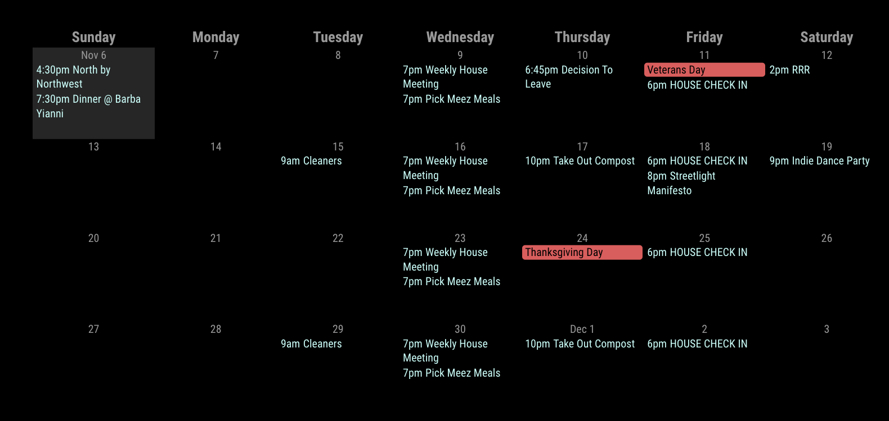

# Module: MMM-MonthlyCalendar
The module allows you to view your calendar events in a monthly calendar view.



## Installation

In your terminal, go to your MagicMirror's Module folder:
````
cd ~/MagicMirror/modules
````

Clone this repository:
````
git clone https://github.com/kolbyjack/MMM-MonthlyCalendar.git
````

Configure the module in your `config.js` file.

**Note:** After starting the Mirror, it will take a few seconds before events start to appear.

## Using the module

To use this module, add it to the modules array in the `config/config.js` file:
````javascript
modules: [
  {
    module: "MMM-MonthlyCalendar",
    position: "bottom_bar",
    config: { // See "Configuration options" for more information.
      mode: "fourWeeks",
    }
  }
]
````

You will likely also want to set `"broadcastPastEvents": true` in your [calendar module configuration](https://docs.magicmirror.builders/modules/calendar.html#configuration-options) so past events are still displayed.

## Configuration options

The following properties can be configured:

|Option|Default|Description|
|---|---|---|
|`mode`|`"currentMonth"`|Which type of calendar to show.  Possible values are `lastMonth`, `currentMonth`, `nextMonth`, `currentWeek`, `twoWeeks`, `threeWeeks`, and `fourWeeks`.|
|`displaySymbol`|`false`|Whether to show symbols next to events.|
|`firstDayOfWeek`|`"sunday"`|Which day to use as the start of the week.  Use `"today"` to always show the current day in the first column.|
|`hideCalendars`|`[]`|A list of calendar names to hide from the view.|
|`luminanceThreshold`|`110`|The luminance value above which full-day event text will be drawn black.|
|`showWeekNumber`|`false`|Whether to show the week number of the first day of each row.|
|`wrapTitles`|`false`|Whether to allow event titles to wrap across multiple lines or truncate them.|
|`EventColor`|`{keyword:"",color:""}`| Allows custom colors on events when keyword is contained within event title
